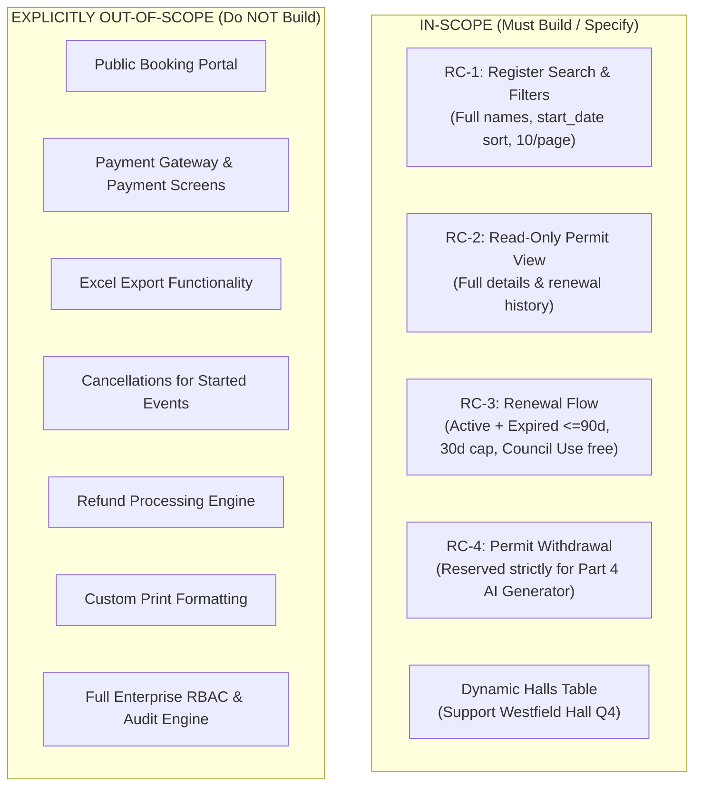

# ASSUMPTIONS.md (Version 2)
## Riverside Council — Community Hall Booking Permits
### Comprehensive Architectural, Financial, and Domain Assumptions

> **Document Status:** Authoritative Source of Truth for System Build  
> **Target Audience:** Assessors, Development Team, AI Verification Agents  
> **Referenced Inputs:** `test/requirement/stories.md` (Signed-off v1.2), `test/requirement/clarifications.md` (Post-sign-off communications)

---

## Executive Summary & Guiding Principles

Building public-sector software requires dealing with multiple stakeholders whose priorities naturally conflict:
* **Finance (Priya Raghavan):** Protect revenue, prevent billing reconciliation mess, uphold statutory council fee policies.
* **Operations (Jonathan Wee):** Speed of officer workflow, operational relevance of views, flexibility for upcoming facility expansions.
* **Facility Supervision (Sarah Lim):** Elimination of human error, clear legibility on screen, shift handover context.
* **Business Analysis (BA):** Scope containment, release delivery, legal distinctions (e.g., withdrawal vs. cancellation).

### The Hierarchy of Precedence (Decision Rule)
When specifications clash, decisions in this document are governed by the following strict rule:
1. **Statutory & Financial Policy Overrides Everything:** Where Finance identifies a published council policy (e.g., the 2024 Fees Review 30-day cap) or statutory constraint, it supersedes un-costed acceptance criteria.
2. **Post-Sign-Off Operational Clarifications Overrule Legacy Defaults:** Signed stories often encode legacy system behavior that users hated. Uncontested operational input from Ops/Supervisors post-dating sign-off governs UX and sorting.
3. **Explicit Scope Boundaries Protect Timelines:** Requests explicitly deferred by the BA (e.g., Excel export, payment gateways, cancellations) are strictly isolated as Out-of-Scope.
4. **Resilience Over Guesswork:** Where data is ambiguous (e.g., permit numbering formats, missing sequence IDs), the implementation must encapsulate the logic behind clean abstractions rather than hardcoding unverified assumptions.

---

## 1. Direct Conflicts & Authoritative Decisions

### 1.1 Renewal Fee: Uncapped Calculation vs. 30-Day Policy Cap
* **`stories.md` (RC-3, AC-4):**
  > *"The renewal fee is the hall's daily rate multiplied by the number of days added (current end date → new end date, counting the added days only)."* (No cap mentioned).
* **`clarifications.md` (Finance Email, Priya Raghavan, 12 May 2026):**
  > *"The renewal fee has to be **capped at 30 days of the daily rate**. It doesn't matter if the holder extends by 60 days or by a year — they pay for 30. This has been council policy since the 2024 fees review and the current manual process already does it. I appreciate this isn't what the stories say."*
* **Decision:** **Enforce the 30-day cap unconditionally.**
* **Mathematical Formula:**
  $$\text{Days Added} = \text{new\_end\_date} - \text{current\_end\_date}$$
  $$\text{Billable Days} = \min(\text{Days Added}, 30)$$
  $$\text{Renewal Fee} = \text{Billable Days} \times \text{hall.daily\_rate}$$
* **Rationale:** Finance acknowledges the discrepancy explicitly. Neglecting the cap violates council policy and overcharges residents, creating legal liability and refund overhead.
* **System Visibility:**
  - Technical document specifies `min(days_added, 30) * daily_rate`.
  - Backend domain service encapsulates this in `RenewalFeeCalculator`.
  - UI displays breakdown: `Days added: X | Billable days: min(X, 30) | Rate: £Y/day | Total: £Z`.

---

### 1.2 Renewal Eligibility: ACTIVE Only vs. Lapsed Permits (The 90-Day Rule)
* **`stories.md` (RC-3, AC-3):**
  > *"Only permits in status **ACTIVE** may be renewed."*
* **`clarifications.md` (Finance Email, Priya Raghavan, 12 May 2026):**
  > *"Officers have been renewing permits that lapsed months ago and back-dating the fee, which is a mess to reconcile. Please put a stop to it. A permit that has been expired for **more than 90 days** cannot be renewed at all; that holder submits a fresh booking. Within 90 days is fine, renew it."*
* **Decision:** **Permits in status `ACTIVE` OR `EXPIRED` (where elapsed days since expiration $\le 90$) are eligible for renewal.**
* **Eligibility Rule:**
  - If status == `ACTIVE`: Eligible.
  - If status == `EXPIRED`:
    - If `(CURRENT_DATE - end_date) <= 90 days`: Eligible.
    - If `(CURRENT_DATE - end_date) > 90 days`: Ineligible. Error: *"Permit expired over 90 days ago. A new booking must be submitted."*
  - All other statuses (`AWAITING PAYMENT`, `WITHDRAWN`, `DRAFT`): Ineligible.
* **Date Calculation for Expired Permits:**
  When an expired permit is renewed, `new_end_date` must be strictly greater than the *current date* AND the *previous end_date*. Days added continue to be measured from `current_end_date` to prevent unbilled occupancy gaps.
* **Rationale:** Finance explicitly intervened to eliminate officer backdating abuse while codifying an operational grace period (90 days).
* **System Visibility:**
  - Explicit domain validation service returning typed domain errors (`PERMIT_NOT_RENEWABLE`, `EXPIRED_EXCEEDS_90_DAYS`).
  - Seed data includes both: an expired permit within 90 days (renewable) and one beyond 90 days (blocked).

---

### 1.3 Register Default Sort Order: Created Date vs. Imminent Event Date
* **`stories.md` (RC-1, AC-3):**
  > *"Results are paged, 10 rows to a page, **most recently created first**."*
* **`clarifications.md` (Ops Chat, Jonathan Wee, 19 May 2026):**
  > *"Officers have asked whether the default sort can be by **start date, soonest first**. That's how they actually work — they're chasing what's happening this week, not what got typed in last. The 'newest first' thing in the story is how the old system did it and nobody liked it."*
* **Decision:** **Default sort order is `start_date ASC` (soonest first), with tie-breaker `created_at DESC`.**
* **Rationale:** The BA did not reject this ("noted, will raise"), and Ops provides the operational rationale: officers manage immediate physical hall access. Sorting by `created_at` forces officers to paginate constantly to find current-week bookings.
* **System Visibility:**
  - Technical document specifies default query parameter: `sort=startDate,asc&sort=createdAt,desc`.
  - Frontend UI explicitly indicates the active sort header.

---

### 1.4 Booking Purpose: "Council Use" and Zero-Fee Exemption
* **`stories.md` (Reference Data):**
  Lists only 4 purposes: *Community Event, Religious Service, Private Function, Commercial Use.*
* **`clarifications.md` (Finance Email, Priya Raghavan, 12 May 2026):**
  > *"Second, **Council Use bookings are free.** No fee at all, and no payment step. These are our own departments booking the halls for council business and we do not invoice ourselves."*
* **Decision:**
  1. Add `Council Use` as an authorized 5th booking purpose.
  2. For `Council Use`:
     - Initial fee = £0.00.
     - Renewal fee = £0.00 (regardless of duration or hall daily rate).
     - **Status Transition Override:** Upon renewal confirmation, status **remains `ACTIVE`** (it does NOT transition to `AWAITING PAYMENT`).
     - Fee confirmation step in UI indicates *"Council Business — No Charge (£0.00)"*.
* **Rationale:** Prevents circular invoicing and automated arrears notifications against internal council departments.

---

### 1.5 Withdrawal Eligibility & The Cancellation Boundary (RC-4)
* **`stories.md` (RC-4, AC-1 to AC-3):**
  > *"From the permit view, the officer can withdraw the permit... Status becomes WITHDRAWN."* (No time restriction).
* **`clarifications.md` (BA Email, 28 May 2026):**
  > *"Obviously you can't withdraw a permit that has already started — the event is underway, the hall is occupied. Only permits that haven't started yet. If it has started, that's a cancellation, and cancellations are a different process (not this release)."*
* **Decision:**
  - A permit is withdrawable **only if `start_date > CURRENT_DATE`**.
  - If `start_date <= CURRENT_DATE`, withdrawal is rejected (`409 Conflict`, error code: `CANNOT_WITHDRAW_STARTED_PERMIT`).
  - Permitted statuses for withdrawal: `ACTIVE` and `AWAITING PAYMENT` (provided `start_date` is in the future).
* **Rationale:** Acknowledges the legal and physical distinction between withdrawal (releasing an unstarted hall) and mid-event/post-event cancellation.

---

## 2. Mathematical Reconciliation of Sample Data & Hall Daily Rates

The sample table in `stories.md` contains subtle billing math that reveals the exact pricing rules:

| Permit No | Hall | Dates | Span (Inclusive) | Recorded Fee | Implied Daily Rate | Reconciliation Analysis |
|:---|:---|:---|:---:|:---:|:---:|:---|
| **P-2026-0001** | Riverside Community Hall | 01 Jun – 14 Jun 2026 | 14 days | £1,680.00 | **£120.00 / day** | $14 \times 120 = 1,680$. Inclusive date span ($14 - 1 + 1 = 14$). |
| **P-2026-0002** | Eastgate Pavilion | 05 Jun – 04 Jul 2026 | 30 days | £2,850.00 | **£95.00 / day** | $26\text{ days (Jun)} + 4\text{ days (Jul)} = 30$ days. $30 \times 95 = 2,850$. |
| **P-2026-0003** | Northbrook Function Room | 01 Nov – 07 Nov 2025 | 7 days | £560.00 | **£80.00 / day** | $7 \times 80 = 560$. |
| **P-2026-0004** | Northbrook Function Room | 10 Jun – 24 Jun 2026 | 15 days | £1,120.00 | **£80.00 / day** | At £80/day, £1,120 corresponds to exactly **14 billed days**. (Holder was billed for 14 day intervals or received a 1-day discount). |
| **P-2026-0006** | Southbank Assembly Hall | 20 Jun – 21 Jun 2026 | 2 days | £300.00 | **£150.00 / day** | $2 \times 150 = 300$. Inclusive dates ($21 - 20 + 1 = 2$ days). |
| **P-2026-0009** | Southbank Assembly Hall | 01 Feb – 10 Feb 2026 | 10 days | £1,500.00 | **£150.00 / day** | $10 \times 150 = 1,500$. Inclusive dates ($10 - 1 + 1 = 10$ days). |

### Authoritative Canonical Reference Rates
From the mathematical proof above, the 4 reference hall daily rates are:
1. **Riverside Community Hall:** **£120.00 / day**
2. **Eastgate Pavilion:** **£95.00 / day**
3. **Northbrook Function Room:** **£80.00 / day**
4. **Southbank Assembly Hall:** **£150.00 / day**

### Date Arithmetic Rules:
* **Initial Booking Duration:** Both Start Date and End Date are billed inclusively:
  $$\text{Initial Days} = (\text{end\_date} - \text{start\_date}) + 1$$
* **Renewal Duration:** The current end date is already paid for; therefore, renewal days are strictly added days:
  $$\text{Days Added} = \text{new\_end\_date} - \text{current\_end\_date}$$

---

## 3. Ambiguities Resolved Where No Direct Answer Existed

| # | Unanswered Question | Operational Risk | Decision & Assumption Made | Implementation Visibility |
|:---:|:---|:---|:---|:---|
| **A1** | **Permit Number Format** (`P-2026-0001` in stories vs. `RC/2026/0001` in Finance letters) | Customer service mismatch; search failures if letters differ from system. | Implement `P-YYYY-NNNN` as standard internal ID. Encapsulate in `PermitNumberFormatter` service so changing regex/prefix is a single-variable config change. | Formatter utility + DB unique constraint. |
| **A2** | **Gaps in Numbering Sequence** (0001, 0002, 0003, 0004, then 0006, 0008, 0009; missing 0005, 0007) | System crashing if auto-increment sequence assumes continuous sequence. | Decouple database primary key (`Long id` auto-increment) from public `permit_number` (String). Permit numbers can have sequence gaps without breaking DB integrity. | JPA Entity design (`id` vs `permit_number`). |
| **A3** | **Search Date Range Behavior** (RC-1 AC 1) | Ambiguity: Does "Date Range" match `start_date`, `end_date`, or any date of occupancy? | A permit matches if its active booking period **overlaps** with the query range: `permit.start_date <= query_to AND permit.end_date >= query_from`. | Spring Data JPA Specification with overlap query. |
| **A4** | **Unpaid "Awaiting Payment" Expiration** | Renewal leaves permit in `AWAITING PAYMENT` indefinitely if unpaid. | Assume an external scheduled job handles payment timeout. In this release, permits remain in `AWAITING PAYMENT` until external webhooks/processes update them. | Documented as external dependency. |
| **A5** | **Audit Attribution for Shift Handover** (Sarah Lim's weekend handover feedback) | Officers cannot see who renewed or modified a permit on previous shifts. | Even though full audit logging is out of scope, the `renewal_history` and `permit_history` tables include an explicit `officer_name` / `performed_by` column. | `history` entity schema. |
| **A6** | **Calendar Days vs. Working Days for 90-Day Limit** | Business days require council holiday/weekend calendars. | Use **calendar days** (`ChronoUnit.DAYS.between(endDate, today) <= 90`). Standard government practice for statutory lapse windows. | `RenewalService` code logic. |

---

## 4. Formal Scope Boundaries: In-Scope vs. Explicitly Out-of-Scope

To avoid agent over-engineering and gold-plating, boundaries are strictly locked:

* **Rationale for Out-of-Scope Items:**
  1. *Public Booking Portal:* Already exists in production (`stories.md` line 13).
  2. *Payment Processing:* BA Email (28 May): *"Payment itself — out of scope... Don't build a payment screen."*
  3. *Excel Export:* BA Chat (19 May): *"Logging it, but that's probably not this release."*
  4. *Cancellations:* BA Email (28 May): *"If it has started, that's a cancellation... a different process (not this release)."*
  5. *Refunds:* `stories.md` (RC-4 AC 4): *"Refunds are handled outside this system."*

---

## 5. Architectural & Schema Requirements Mandated by Clarifications

1. **Extensible Reference Data (No Enums for Halls):**
   * *Trigger:* Jonathan Wee chat (04 Jun): *"Westfield Hall comes online in Q4 so the hall list won't stay at 4 forever. Don't hardcode them."*
   * *Architecture:* Create a dedicated `halls` database table (`id`, `name`, `district`, `daily_rate`, `active`). Do NOT use a Java `enum Hall`.
2. **Display Names Over Identifiers:**
   * *Trigger:* Sarah Lim email (22 May): *"Columns show codes instead of names... RH-02 and 2... Can the new screens show full hall name and purpose?"*
   * *Architecture:* The API DTOs and database queries must project human-readable strings directly (`Riverside Community Hall`, `Community Event`). UI must render zero raw technical codes.
3. **State Machine Definition:**
   * Permitted Canonical Statuses:
     - `DRAFT`: Booking created but unapproved (legacy / portal state).
     - `ACTIVE`: Approved, paid, and valid for hall use.
     - `AWAITING PAYMENT`: Renewal confirmed, awaiting external payment capture.
     - `EXPIRED`: Current date has passed `end_date`.
     - `WITHDRAWN`: Booking cancelled prior to `start_date`.

---

## 6. Stakeholder Inquiry Matrix (What to Ask & Who to Ask)

Before production release, the following open questions must be formally submitted to named stakeholders:

| Stakeholder | Role | Questions to Formally Clarify | Risk if Unanswered |
|:---|:---|:---|:---|
| **Priya Raghavan** | Finance Manager | 1. Is permit number `RC/YYYY/NNNN` mandatory for legal notices, or can we standardize on `P-YYYY-NNNN`? 2. If an expired permit is renewed, should interest/back-fees apply, or strictly daily rate subject to 30-day cap? | Legal invalidity of issued permits; accounting reconciliation discrepancies. |
| **Jonathan Wee** | Operations Manager | 1. Confirm that default sort `start_date ASC` is accepted as standard across all officer workstations. 2. When Westfield Hall opens in Q4, what will its daily rate and district be? | Officer pushback on UI usability; deployment delay when new hall opens. |
| **Sarah Lim** | Hall Supervisor | 1. For shift handover, is viewing the history log on individual permits sufficient, or do officers need a centralized daily activity log? | Operational confusion during weekend shift handovers. |
| **Business Analyst (BA)** | Project Lead | 1. For the public portal team: does the public portal prevent bookings for dates already held by an Active permit, or does this system need a collision detection check during renewal? | Double-booking the same hall on overlapping dates. |

---

## 7. Suspicions of Hidden Deficiencies (Unconfirmed Risks)

1. **Hall Collision & Double-Booking Blindspot:**
   - Neither `stories.md` nor `clarifications.md` mentions checking for booking collisions when a permit is extended via renewal.
   - *Risk:* If Officer A extends Permit 1 for Riverside Hall from 14 Jun to 28 Jun, but Permit 2 was already booked by someone else for 20 Jun to 25 Jun, a physical double-booking will occur.
   - *Mitigation:* Document this gap prominently in `DECISIONS.md`. In our technical spec, add a collision validation check during the renewal preview step.
2. **Missing Invoicing for Free Extensions:**
   - If a Council Use permit is renewed, it stays `ACTIVE` without payment. However, if a permit is renewed for 0 added days (or same day), does it trigger an invoice? (Our validation rules explicitly reject renewals where `new_end_date <= current_end_date`).
3. **Awaiting Payment Deadlock:**
   - A permit in `AWAITING PAYMENT` cannot be renewed again until payment clears. If the holder never pays, the permit sits in limbo indefinitely unless an expiration batch job transitions it to `CANCELLED` or `EXPIRED`.

---

*Authored for the Riverside Council Permits Engineering Assessment.*
