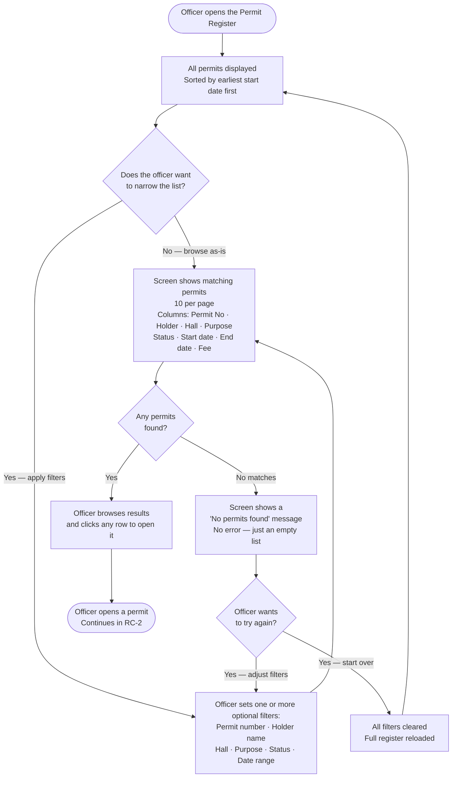
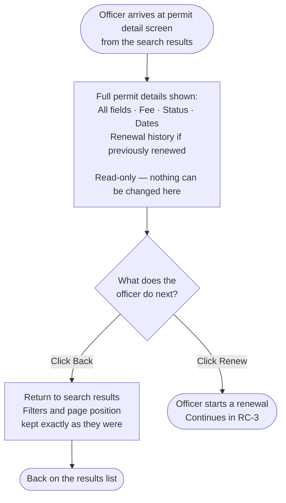
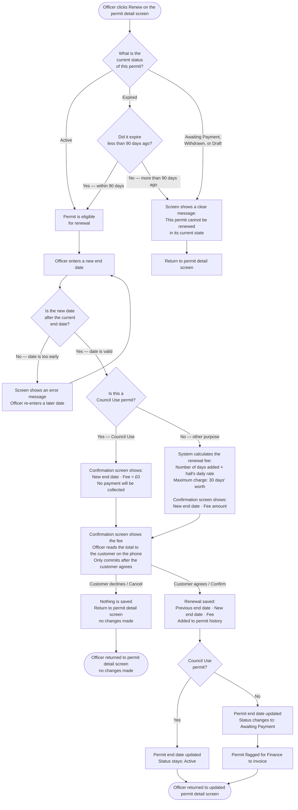

# 1a — Business Flowchart
## Riverside Council · Community Hall Booking Permits
### Journeys: Search the Register · View a Permit · Renew a Permit

| Field | Detail |
|---|---|
| **Document reference** | MGG-1A |
| **Version** | 1.0 DRAFT |
| **Date** | 23 September 2026 |
| **Audience** | Permits Officers and council management — non-technical readers |
| **Status** | Awaiting client sign-off |

---

## Purpose of Document

This document shows, in plain language, how a Permits Officer moves through three journeys in the new Hall Permit Register:

- **RC-1 — Search the Register:** how an officer finds the permit they need.
- **RC-2 — View a Permit:** what information the officer sees when they open a permit.
- **RC-3 — Renew a Permit:** the steps an officer takes to extend a permit's end date, including the fee confirmation.

The diagrams are written for a non-technical audience. They show screens, decisions, and outcomes — not software internals. They are intended to be handed to council officers for review and sign-off before build begins.

---

## RC-1 · Search the Register

---

## RC-2 · View a Permit

---

## RC-3 · Renew a Permit

---

### Notes for reviewers

**Council Use permits are always free.**
When the purpose is "Council Use", the renewal fee is £0 and the permit moves straight to a confirmation screen — there is no payment step and the status remains Active after confirming.

**Expired permits have a 90-day grace window.**
An Expired permit can still be renewed, but only if it expired fewer than 90 days before today. After 90 days the renewal option is blocked and the officer sees a plain explanation on screen — not a technical error.

**Only Active and recently Expired permits can be renewed.**
Permits with a status of Awaiting Payment, Withdrawn, or Draft cannot be renewed. The screen shows a clear, plain-language message explaining this, and the officer is taken back to the permit detail view.

**Fee calculation for all other permits.**
The renewal fee equals the number of days being added multiplied by the hall's daily rate. The fee is capped: even if the extension is longer, the maximum charge equals 30 days' worth of the daily rate.

**The Reset button returns to a clean slate.**
Clicking Reset on the register screen removes all filters and reloads the full list of permits sorted by earliest start date. It does not delete or change any permits.

**Search filters are preserved when navigating.**
When an officer opens a permit from the search results and then clicks Back, they return to exactly the same results page with the same filters — they do not lose their place.

**The register is view-only browsing.**
Opening a permit from the register takes the officer to a read-only detail screen. Nothing on that screen can accidentally change the permit — changes only happen through the Renew action and the subsequent confirmation step.
