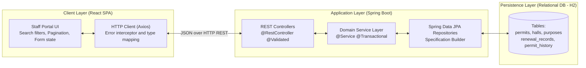
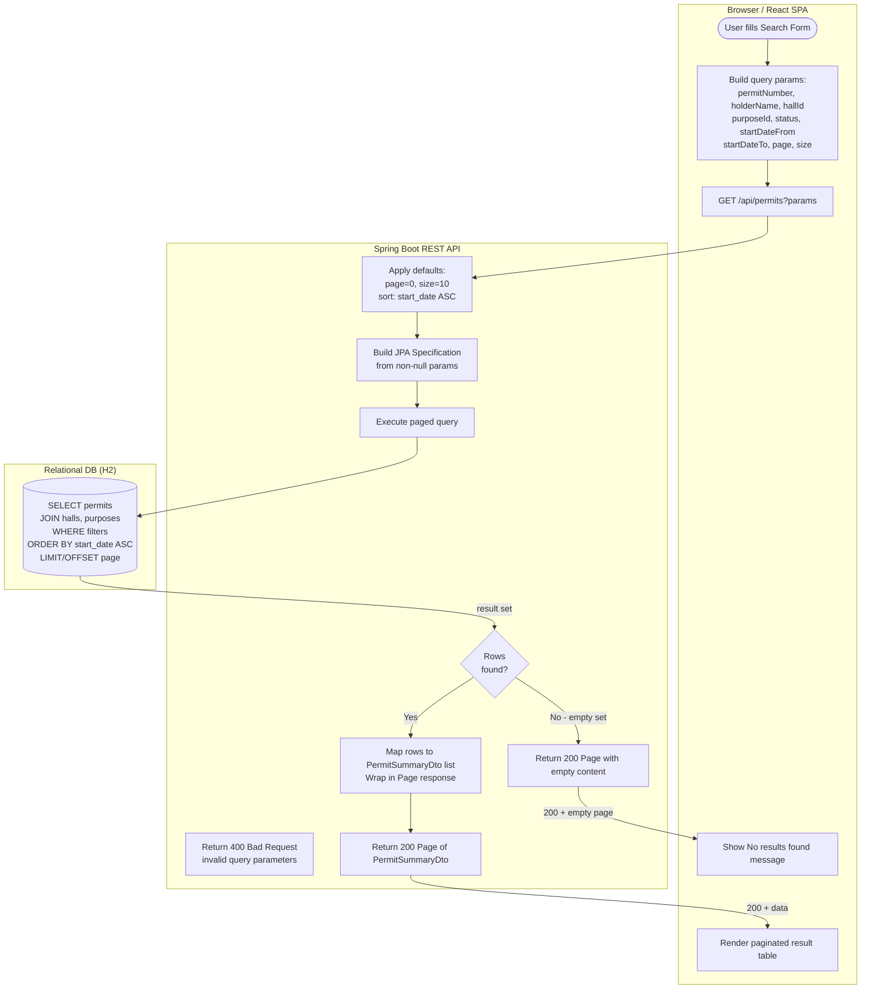
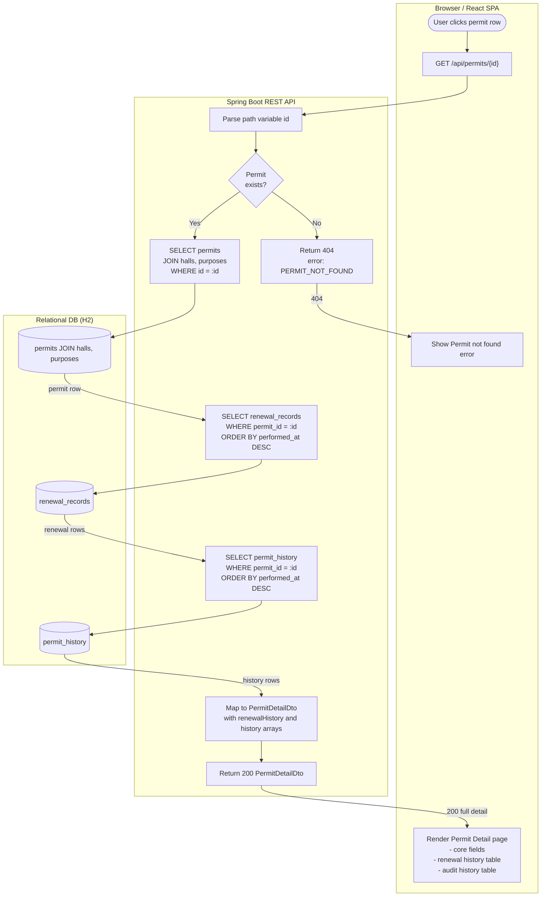
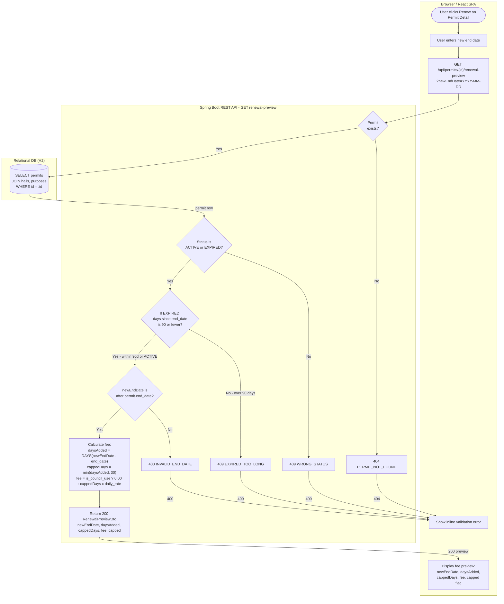
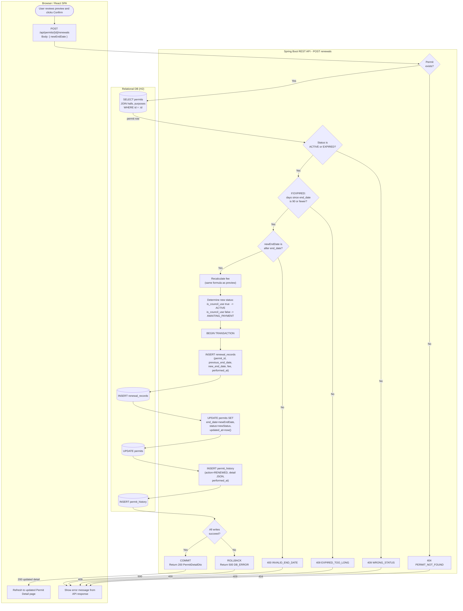

# Part 1b — Technical Flowchart: RC-1 Search, RC-2 View, RC-3 Renew

| Field | Detail |
|---|---|
| **Document reference** | MGG-1B |
| **Version** | 1.0 DRAFT |
| **Date** | 23 September 2026 |
| **Audience** | Engineers and technical reviewers |
| **Stack** | React SPA → Spring Boot REST API → Relational DB (H2) |
| **Status** | Internal — not for client sign-off |

---

## Purpose of Document

This document shows the technical flow of three journeys in the Hall Permit Register system, from browser interaction through to database reads and writes. It is intended for engineers building or reviewing the system.

For each journey it covers:
- which React component initiates the action and which API endpoint is called;
- which validations the Spring Boot API applies, in what order, and what error codes it returns on failure;
- which database tables are read or written, and in what sequence;
- the happy path and all documented unhappy paths.

**RC-3 (Renew)** is split into two diagrams — Preview (GET) and Confirm (POST) — because the two requests have different consequences and it is important that engineers understand the server re-validates everything on the POST, independent of the preview response.

This document should be read alongside:
- **1a (Business Flowchart)** — the same journeys for a non-technical audience.
- **1d (Technical Document)** — the data model, full endpoint contracts, and precise business rules to build from.

---

## System Architecture Overview



---

## RC-1 — Search Permits



---

## RC-2 — View Permit Detail



---

## RC-3a — Renew Permit: Preview



---

## RC-3b — Renew Permit: Confirm



---

## Endpoint Summary Table

| # | Method | Endpoint | Query / Body | DB Operation | Success | Error Codes |
|---|--------|----------|--------------|--------------|---------|-------------|
| 1 | `GET` | `/api/permits` | `permitNumber`, `holderName`, `hallId`, `purposeId`, `status`, `startDateFrom`, `startDateTo`, `page=0`, `size=10` | `SELECT` permits + joins, paginated, `ORDER BY start_date ASC` | `200 Page<PermitSummaryDto>` (empty page if no rows) | — |
| 2 | `GET` | `/api/permits/{id}` | Path: `id` | `SELECT` permit + joins; `SELECT` renewal_records; `SELECT` permit_history | `200 PermitDetailDto` with `renewalHistory[]`, `history[]` | `404 PERMIT_NOT_FOUND` |
| 3 | `GET` | `/api/permits/{id}/renewal-preview` | Path: `id`; Query: `newEndDate` | `SELECT` permit + joins (read-only) | `200 RenewalPreviewDto {newEndDate, daysAdded, cappedDays, fee, capped}` | `404 PERMIT_NOT_FOUND`, `400 INVALID_END_DATE`, `409 WRONG_STATUS`, `409 EXPIRED_TOO_LONG` |
| 4 | `POST` | `/api/permits/{id}/renewals` | Path: `id`; Body: `{newEndDate}` | **Transaction:** `INSERT` renewal_records → `UPDATE` permits → `INSERT` permit_history | `200 PermitDetailDto` (updated) | `404 PERMIT_NOT_FOUND`, `400 INVALID_END_DATE`, `409 WRONG_STATUS`, `409 EXPIRED_TOO_LONG`, `500 DB_ERROR` |

---

### Fee Calculation Reference

```
daysAdded  = DAYS(newEndDate - permit.end_date)
cappedDays = MIN(daysAdded, 30)
fee        = purpose.is_council_use ? 0.00 : cappedDays x hall.daily_rate
```

### Status Transition on Renewal

```
is_council_use = true   ->  status stays   ACTIVE
is_council_use = false  ->  status becomes AWAITING_PAYMENT
```

### Eligibility Rules (applied in both preview and commit)

| Check | Condition | Error |
|-------|-----------|-------|
| Status | `ACTIVE` or `EXPIRED` | `409 WRONG_STATUS` |
| Expiry window | If `EXPIRED`: `DAYS(today - end_date) <= 90` | `409 EXPIRED_TOO_LONG` |
| Date order | `newEndDate > permit.end_date` | `400 INVALID_END_DATE` |
