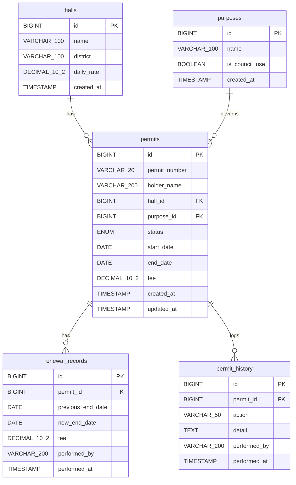
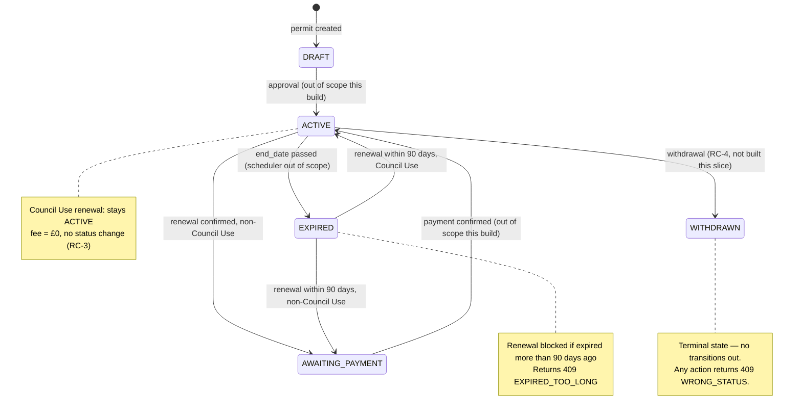

# Technical Document — Hall Permit Management System
**Part 1d · Job Test Artefact**

| Field | Detail |
|---|---|
| **Document reference** | MGG-1D |
| **Version** | 1.0 DRAFT |
| **Date** | 23 September 2026 |
| **Audience** | Engineers and AI agents building the system |
| **Status** | DRAFT — pending stakeholder sign-off on flagged assumptions |

---

## Purpose of Document

This document is the **build specification** for the Riverside Council Hall Permit Register. It contains everything an engineer (or AI agent) needs to implement RC-1, RC-2, and RC-3 without referring to any other source.

Specifically it provides:
- **Data model** — all tables, columns, types, constraints, and relationships, as an ERD and as column-by-column definitions.
- **Status state machine** — every valid permit status and every transition between them, including which are in scope for this build.
- **Seed data** — reference data (halls, purposes) and sample permits, including edge-case records needed to demonstrate and test the business rules.
- **Endpoint contracts** — for each endpoint: method, path, query parameters, request/response shapes, validation order, error codes, and DB operations.
- **Business rules** — stated precisely enough to implement without guessing: fee formula, eligibility checks, status transitions, pagination, and atomicity requirements.
- **Open assumptions** — every decision made without confirmed stakeholder input, with risk level and owner flagged.

**If something is not in this document, it should not appear in the code.** Gaps found during implementation must be recorded and resolved here before being built.

This document should be read alongside:
- **ASSUMPTIONS.md** — the full record of contradictions found, decisions made, and questions outstanding.
- **1c (Functional Document)** — the client-facing description of the same behaviour.

---

## Table of Contents
1. [Data Model](#1-data-model)
2. [Status State Machine](#2-status-state-machine)
3. [Seed Data](#3-seed-data)
4. [Endpoint Contracts](#4-endpoint-contracts)
   - [RC-1: Search Permits](#rc-1-search-permits)
   - [RC-2: View a Permit](#rc-2-view-a-permit)
   - [RC-3: Renew a Permit](#rc-3-renew-a-permit)
5. [Business Rules](#5-business-rules)
6. [Open Assumptions](#6-open-assumptions)

---

## 1. Data Model

### 1.1 Entity-Relationship Diagram



---

### 1.2 Table-by-Table Definitions

#### Table: `halls`

Represents a physical hall available for hire within the council.

| Column | Type | Constraints | Notes |
|--------|------|-------------|-------|
| `id` | `BIGINT` | PK, AUTO_INCREMENT | Surrogate key |
| `name` | `VARCHAR(100)` | NOT NULL | Full display name of the hall |
| `district` | `VARCHAR(100)` | NOT NULL | Administrative district the hall belongs to |
| `daily_rate` | `DECIMAL(10,2)` | NOT NULL | Hire cost per calendar day; used in fee calculation |
| `active` | `BOOLEAN` | NOT NULL DEFAULT TRUE | Set to FALSE when a hall is retired; existing permits unaffected |
| `created_at` | `TIMESTAMP` | NOT NULL DEFAULT NOW() | Audit timestamp |

---

#### Table: `purposes`

Lookup table for the approved purposes under which a permit may be issued.

| Column | Type | Constraints | Notes |
|--------|------|-------------|-------|
| `id` | `BIGINT` | PK, AUTO_INCREMENT | Surrogate key |
| `code` | `VARCHAR(50)` | NOT NULL UNIQUE | Stable machine-readable key, e.g. `COUNCIL_USE`. Separate from display name which may change. |
| `name` | `VARCHAR(100)` | NOT NULL | Display name returned in API responses |
| `is_council_use` | `BOOLEAN` | NOT NULL DEFAULT FALSE | `TRUE` → fee is £0 and status stays ACTIVE on renewal |
| `active` | `BOOLEAN` | NOT NULL DEFAULT TRUE | Set to FALSE to retire a purpose without breaking existing permits |
| `created_at` | `TIMESTAMP` | NOT NULL DEFAULT NOW() | Audit timestamp |

---

#### Table: `permits`

Core entity. One permit authorises one permit holder to use one hall for a specified period under one purpose.

| Column | Type | Constraints | Notes |
|--------|------|-------------|-------|
| `id` | `BIGINT` | PK, AUTO_INCREMENT | Surrogate key |
| `permit_number` | `VARCHAR(20)` | NOT NULL, UNIQUE | Format: `P-YYYY-NNNN` — **provisional** (see §6, assumption §1.6) |
| `holder_name` | `VARCHAR(200)` | NOT NULL | Name of individual or organisation holding the permit |
| `hall_id` | `BIGINT` | NOT NULL, FK → `halls(id)` | The hall being hired |
| `purpose_id` | `BIGINT` | NOT NULL, FK → `purposes(id)` | The purpose of hire |
| `status` | `ENUM` | NOT NULL | One of: `DRAFT`, `ACTIVE`, `AWAITING_PAYMENT`, `EXPIRED`, `WITHDRAWN` |
| `start_date` | `DATE` | NOT NULL | Inclusive start of the hire period |
| `end_date` | `DATE` | NOT NULL | Inclusive end of the hire period |
| `fee` | `DECIMAL(10,2)` | NOT NULL | Fee charged at creation or after renewal |
| `created_at` | `TIMESTAMP` | NOT NULL DEFAULT NOW() | Creation timestamp |
| `updated_at` | `TIMESTAMP` | NOT NULL DEFAULT NOW() | Updated on every status or date change |

**ENUM values:**

| Value | Meaning |
|-------|---------|
| `DRAFT` | Created but not yet approved |
| `ACTIVE` | Approved and within its valid period |
| `AWAITING_PAYMENT` | Renewal confirmed; payment outstanding |
| `EXPIRED` | `end_date` has passed; no renewal yet actioned |
| `WITHDRAWN` | Cancelled; terminal state |

---

#### Table: `renewal_records`

Immutable audit log of every successful renewal operation. One row per renewal.

| Column | Type | Constraints | Notes |
|--------|------|-------------|-------|
| `id` | `BIGINT` | PK, AUTO_INCREMENT | Surrogate key |
| `permit_id` | `BIGINT` | NOT NULL, FK → `permits(id)` | Parent permit |
| `previous_end_date` | `DATE` | NOT NULL | The permit's `end_date` before this renewal |
| `new_end_date` | `DATE` | NOT NULL | The permit's `end_date` after this renewal |
| `fee` | `DECIMAL(10,2)` | NOT NULL | Fee calculated for this renewal (£0 for Council Use) |
| `performed_by` | `VARCHAR(200)` | NULL | Actor identifier; use literal string `'system'` until auth is built |
| `performed_at` | `TIMESTAMP` | NOT NULL DEFAULT NOW() | Wall-clock time of the renewal |

---

#### Table: `permit_history`

General-purpose event log for a permit. Covers all significant lifecycle actions.

| Column | Type | Constraints | Notes |
|--------|------|-------------|-------|
| `id` | `BIGINT` | PK, AUTO_INCREMENT | Surrogate key |
| `permit_id` | `BIGINT` | NOT NULL, FK → `permits(id)` | Parent permit |
| `action` | `VARCHAR(50)` | NOT NULL | Verb describing the event: `RENEWED`, `STATUS_CHANGED`, `WITHDRAWN`, etc. |
| `detail` | `TEXT` | NULL | JSON string with event-specific payload |
| `performed_by` | `VARCHAR(200)` | NULL | Actor identifier; `'system'` until auth is built |
| `performed_at` | `TIMESTAMP` | NOT NULL DEFAULT NOW() | Wall-clock time of the event |

**Known `action` values in this release:**

| Action | When inserted |
|--------|--------------|
| `RENEWED` | POST /api/permits/{id}/renewals (success) |
| `STATUS_CHANGED` | Any future status transition outside of renewal |
| `WITHDRAWN` | RC-4 (not built in this slice) |

---

## 2. Status State Machine

### 2.1 Diagram



### 2.2 Transition Table

| From | To | Trigger | Condition | In-scope? |
|------|----|---------|-----------|-----------|
| `[*]` | `DRAFT` | Permit creation | — | Out of scope (seed data only) |
| `DRAFT` | `ACTIVE` | Approval | — | Out of scope this build |
| `ACTIVE` | `ACTIVE` | Renewal | `purpose.is_council_use = TRUE` | **RC-3 ✓** |
| `ACTIVE` | `AWAITING_PAYMENT` | Renewal | `purpose.is_council_use = FALSE` | **RC-3 ✓** |
| `ACTIVE` | `EXPIRED` | Date passage | `end_date < NOW()` | Out of scope (scheduler) |
| `ACTIVE` | `WITHDRAWN` | Withdrawal | — | RC-4, not built this slice |
| `AWAITING_PAYMENT` | `ACTIVE` | Payment confirmed | — | Out of scope this build |
| `EXPIRED` | `ACTIVE` | Renewal | within 90 days + Council Use | **RC-3 ✓** |
| `EXPIRED` | `AWAITING_PAYMENT` | Renewal | within 90 days + non-Council Use | **RC-3 ✓** |
| `EXPIRED` | blocked | Renewal attempted | > 90 days after expiry | **RC-3 ✓ (error path)** |
| `WITHDRAWN` | — | Any | — | Terminal; always rejected |

> [!IMPORTANT]
> `WITHDRAWN` is a **terminal state**. No transition out of `WITHDRAWN` is permitted. Any renewal or status-change request against a `WITHDRAWN` permit must return `409 WRONG_STATUS`.

---

## 3. Seed Data

> [!NOTE]
> Hall daily rates are **inferred from sample permit data** and have **not been confirmed by Finance** (see §6, assumption §3.L). Flag these values before go-live.

### 3.1 Halls

| id | name | district | daily_rate |
|----|------|----------|------------|
| 1 | Riverside Community Hall | Riverside | 120.00 |
| 2 | Eastgate Pavilion | Eastgate | 95.00 |
| 3 | Northbrook Function Room | Northbrook | 80.00 |
| 4 | Southbank Assembly Hall | Southbank | 150.00 |

---

### 3.2 Purposes

| id | name | is_council_use |
|----|------|----------------|
| 1 | Community Event | false |
| 2 | Religious Service | false |
| 3 | Private Function | false |
| 4 | Commercial Use | false |
| 5 | Council Use | **true** |

---

### 3.3 Permits — From Sample Data

| permit_number | holder_name | hall_id | purpose_id | status | start_date | end_date | fee | Notes |
|---|---|---|---|---|---|---|---|---|
| P-2026-0001 | Amelia Tan | 1 | 1 | ACTIVE | 2026-06-01 | 2026-06-14 | 1680.00 | 14d × £120 |
| P-2026-0002 | Grace Fellowship | 2 | 2 | ACTIVE | 2026-06-05 | 2026-07-04 | 2850.00 | 30d × £95 |
| P-2026-0003 | Devi Ramasamy | 3 | 3 | EXPIRED | 2025-11-01 | 2025-11-07 | 560.00 | 7d × £80; **>90 days expired — renewal blocked** |
| P-2026-0004 | Northbrook Yoga Co. | 3 | 4 | ACTIVE | 2026-06-10 | 2026-06-24 | 1120.00 | 14d × £80 |
| P-2026-0006 | Marcus Oyelaran | 4 | 3 | AWAITING_PAYMENT | 2026-06-20 | 2026-06-21 | 300.00 | 2d × £150 |
| P-2026-0008 | Priya Nair | 1 | 3 | WITHDRAWN | 2026-05-20 | 2026-05-22 | 360.00 | Terminal state |
| P-2026-0009 | Southbank Arts Trust | 4 | 1 | EXPIRED | 2026-02-01 | 2026-02-10 | 1500.00 | 10d × £150 |

> [!NOTE]
> Permit numbers P-2026-0005 and P-2026-0007 are intentionally absent from the seed data (gaps in the source sample). The `permit_number` sequence is not guaranteed to be contiguous.

---

### 3.4 Permits — Additional Edge-Case Seeds

| permit_number | holder_name | hall_id | purpose_id | status | start_date | end_date | fee | Purpose |
|---|---|---|---|---|---|---|---|---|
| P-2026-0010 | Riverside Parks Dept | 1 | 5 | ACTIVE | 2026-07-01 | 2026-07-03 | 0.00 | Demonstrates **Council Use free renewal** (ACTIVE → stays ACTIVE, fee £0) |
| P-2026-0011 | Eastgate Drama Club | 2 | 1 | EXPIRED | _see note_ | _~60 days before test-run date_ | 570.00 | Demonstrates **EXPIRED-within-90-days** renewable path |

> [!WARNING]
> **P-2026-0011 `end_date`** must be set at seed time to a date approximately 60 days before the environment's intended test-run date. Using a hardcoded date risks this permit ageing past the 90-day window before testing completes. Consider using a database function (`CURRENT_DATE - INTERVAL 60 DAY`) in the seeder rather than a static literal.

> [!CAUTION]
> **P-2026-0003** (`end_date: 2025-11-07`) will be **> 90 days expired** when tested in mid-2026 (≈ 220+ days). This is intentional — it demonstrates the `EXPIRED_TOO_LONG` error path (409). Do **not** update its `end_date`.

---

### 3.5 Renewal Records — Initial State

No renewal records exist in the initial seed. `renewal_records` starts empty.

---

### 3.6 Permit History — Initial State

No history rows exist in the initial seed. `permit_history` starts empty. The first history row for any permit is written by RC-3 (POST /renewals).

---

## 4. Endpoint Contracts

> [!NOTE]
> All endpoints are under the base path `/api`. Date parameters and response fields use ISO-8601 format (`YYYY-MM-DD` for dates, `YYYY-MM-DDTHH:MM:SSZ` for timestamps). All monetary values are `DECIMAL(10,2)` returned as JSON numbers with two decimal places.

---

### RC-1: Search Permits

#### `GET /api/permits`

Returns a paginated list of permits matching the supplied filters. **All query parameters are optional.** When no parameters are supplied, all permits are returned (paginated).

##### Query Parameters

| Parameter | Type | Description | Example |
|-----------|------|-------------|---------|
| `permitNumber` | String | Case-insensitive **prefix match** (`LIKE 'value%'`) | `P-2026` |
| `holderName` | String | Case-insensitive **partial match** (`LIKE '%value%'`) | `Amelia` |
| `hallId` | Long | Exact match on `permits.hall_id` | `1` |
| `purposeId` | Long | Exact match on `permits.purpose_id` | `5` |
| `status` | String | One of: `DRAFT`, `ACTIVE`, `AWAITING_PAYMENT`, `EXPIRED`, `WITHDRAWN` | `ACTIVE` |
| `startDateFrom` | LocalDate (ISO-8601) | `permits.start_date >= value` (inclusive) | `2026-06-01` |
| `startDateTo` | LocalDate (ISO-8601) | `permits.start_date <= value` (inclusive) | `2026-06-30` |
| `page` | Integer | Zero-indexed page number. **Default: 0** | `0` |
| `size` | Integer | Records per page. **Default: 10** | `10` |

##### Sort

Fixed: `permits.start_date ASC`. Not user-configurable in this release (see §6, assumption §1.3).

##### Response — 200 OK

```json
{
  "content": [
    {
      "id": 1,
      "permitNumber": "P-2026-0001",
      "holderName": "Amelia Tan",
      "hallName": "Riverside Community Hall",
      "purposeName": "Community Event",
      "status": "ACTIVE",
      "startDate": "2026-06-01",
      "endDate": "2026-06-14",
      "fee": 1680.00
    }
  ],
  "page": 0,
  "size": 10,
  "totalElements": 7,
  "totalPages": 1
}
```

##### Response Field Definitions

| Field | Type | Notes |
|-------|------|-------|
| `content` | Array | Zero or more permit summary objects |
| `content[].id` | Long | Database PK |
| `content[].permitNumber` | String | Format: `P-YYYY-NNNN` |
| `content[].holderName` | String | Full name of permit holder |
| `content[].hallName` | String | Full display name from `halls.name` — **never an ID or code** |
| `content[].purposeName` | String | Full display name from `purposes.name` — **never an ID or code** |
| `content[].status` | String | Current permit status enum value |
| `content[].startDate` | LocalDate | ISO-8601 |
| `content[].endDate` | LocalDate | ISO-8601 |
| `content[].fee` | Decimal | Two decimal places |
| `page` | Integer | Current page index (zero-based) |
| `size` | Integer | Requested page size |
| `totalElements` | Long | Total matching records across all pages |
| `totalPages` | Integer | Total pages at the given `size` |

##### Behaviour Rules

- **No results:** Returns HTTP **200** with `content: []` and `totalElements: 0`. **Never a 404.**
- **Invalid `status` value:** Returns HTTP **400** with an appropriate validation error.
- **Invalid date format:** Returns HTTP **400** with an appropriate validation error.
- `hallName` and `purposeName` are resolved via JOIN — never expose raw IDs in display fields.

---

### RC-2: View a Permit

#### `GET /api/permits/{id}`

Returns the full detail of a single permit, including its complete renewal and history logs.

##### Path Parameter

| Parameter | Type | Required | Description |
|-----------|------|----------|-------------|
| `id` | Long | Yes | Database PK of the permit |

##### Response — 200 OK

```json
{
  "id": 1,
  "permitNumber": "P-2026-0001",
  "holderName": "Amelia Tan",
  "hallId": 1,
  "hallName": "Riverside Community Hall",
  "purposeId": 1,
  "purposeName": "Community Event",
  "isCouncilUse": false,
  "status": "ACTIVE",
  "startDate": "2026-06-01",
  "endDate": "2026-06-14",
  "fee": 1680.00,
  "createdAt": "2026-05-01T09:00:00Z",
  "renewalHistory": [
    {
      "id": 1,
      "previousEndDate": "2026-06-14",
      "newEndDate": "2026-06-28",
      "fee": 1680.00,
      "performedAt": "2026-06-10T14:30:00Z"
    }
  ],
  "history": [
    {
      "action": "RENEWED",
      "detail": "Extended to 2026-06-28, fee £1,680.00",
      "performedAt": "2026-06-10T14:30:00Z"
    }
  ]
}
```

##### Response Field Definitions

| Field | Type | Notes |
|-------|------|-------|
| `id` | Long | Database PK |
| `permitNumber` | String | `P-YYYY-NNNN` |
| `holderName` | String | — |
| `hallId` | Long | FK value (retained in detail view for frontend link/navigation) |
| `hallName` | String | Display name from `halls.name` |
| `purposeId` | Long | FK value (retained in detail view) |
| `purposeName` | String | Display name from `purposes.name` |
| `isCouncilUse` | Boolean | Derived from `purposes.is_council_use`; surfaced for UI conditional logic |
| `status` | String | Current status enum value |
| `startDate` | LocalDate | ISO-8601 |
| `endDate` | LocalDate | ISO-8601 — **current** end date after any renewals |
| `fee` | Decimal | Fee on the permit record (original or most-recent) |
| `createdAt` | DateTime | ISO-8601 UTC |
| `renewalHistory` | Array | All `renewal_records` rows for this permit, ordered by `performed_at ASC` |
| `renewalHistory[].id` | Long | `renewal_records.id` |
| `renewalHistory[].previousEndDate` | LocalDate | — |
| `renewalHistory[].newEndDate` | LocalDate | — |
| `renewalHistory[].fee` | Decimal | Fee for that renewal |
| `renewalHistory[].performedAt` | DateTime | ISO-8601 UTC |
| `history` | Array | All `permit_history` rows for this permit, ordered by `performed_at ASC` |
| `history[].action` | String | e.g. `RENEWED`, `STATUS_CHANGED` |
| `history[].detail` | String | Free-text or JSON string; may be `null` |
| `history[].performedAt` | DateTime | ISO-8601 UTC |

##### Response — 404 Not Found

```json
{
  "error": "PERMIT_NOT_FOUND",
  "message": "No permit found with id 999"
}
```

---

### RC-3: Renew a Permit

RC-3 consists of two endpoints: a **preview** (GET, read-only, no side-effects) and a **commit** (POST, transactional).

---

#### `GET /api/permits/{id}/renewal-preview`

Calculates and returns the projected fee and status for a proposed renewal. **No data is written.**

##### Path Parameter

| Parameter | Type | Required | Description |
|-----------|------|----------|-------------|
| `id` | Long | Yes | Database PK of the permit |

##### Query Parameter

| Parameter | Type | Required | Description |
|-----------|------|----------|-------------|
| `newEndDate` | LocalDate (ISO-8601) | **Yes** | Proposed new end date for the permit |

##### Validation Sequence (fail-fast — evaluate in order)

| Step | Condition | Failure |
|------|-----------|---------|
| 1 | Permit with `id` exists | 404 `PERMIT_NOT_FOUND` |
| 2 | `permit.status IN ('ACTIVE', 'EXPIRED')` | 409 `WRONG_STATUS` |
| 3 | If `status = 'EXPIRED'`: `DAYS.between(permit.endDate, LocalDate.now()) <= 90` | 409 `EXPIRED_TOO_LONG` |
| 4 | `newEndDate.isAfter(permit.endDate)` | 400 `INVALID_END_DATE` |

##### Fee Calculation (only after all validations pass)

```
daysAdded  = ChronoUnit.DAYS.between(permit.endDate, newEndDate)   // always positive (step 4)
cappedDays = Math.min(daysAdded, 30)                                // 30-day council cap
fee        = purpose.isCouncilUse
               ? BigDecimal.ZERO
               : new BigDecimal(cappedDays)
                   .multiply(hall.dailyRate)
                   .setScale(2, RoundingMode.HALF_UP)
capped     = daysAdded > 30 && !purpose.isCouncilUse
```

##### Response — 200 OK

```json
{
  "newEndDate": "2026-07-14",
  "daysAdded": 30,
  "cappedDays": 30,
  "capped": false,
  "fee": 3600.00,
  "isCouncilUse": false
}
```

##### Preview Response Field Definitions

| Field | Type | Notes |
|-------|------|-------|
| `newEndDate` | LocalDate | Echo of the requested `newEndDate` |
| `daysAdded` | Integer | Raw days between current `end_date` and `newEndDate` |
| `cappedDays` | Integer | `min(daysAdded, 30)` — days actually billed |
| `capped` | Boolean | `true` if `daysAdded > 30 && !isCouncilUse` |
| `fee` | Decimal | Calculated renewal fee (£0.00 for Council Use) |
| `isCouncilUse` | Boolean | Derived from `purposes.is_council_use` |

##### Error Responses

```json
// 404
{ "error": "PERMIT_NOT_FOUND" }

// 409 — wrong status (e.g. WITHDRAWN, AWAITING_PAYMENT, DRAFT)
{ "error": "WRONG_STATUS", "currentStatus": "WITHDRAWN" }

// 409 — permit has been expired more than 90 days
{ "error": "EXPIRED_TOO_LONG", "expiredDaysAgo": 112, "maxAllowedDays": 90 }

// 400 — proposed date is not after current end_date
{ "error": "INVALID_END_DATE", "currentEndDate": "2026-06-14", "providedDate": "2026-06-10" }
```

---

#### `POST /api/permits/{id}/renewals`

Commits a renewal. Runs the same validations as the preview endpoint server-side. **Never trust client-side state.**

##### Path Parameter

| Parameter | Type | Required | Description |
|-----------|------|----------|-------------|
| `id` | Long | Yes | Database PK of the permit |

##### Request Body

```json
{ "newEndDate": "2026-07-14" }
```

| Field | Type | Required | Notes |
|-------|------|----------|-------|
| `newEndDate` | LocalDate (ISO-8601) | **Yes** | Proposed new end date |

##### Validation Sequence

Identical to the preview endpoint (fail-fast, same order, same error codes).

##### On Success — Single DB Transaction

All three operations execute within a single `@Transactional` block. Any failure rolls back all three.

```
BEGIN TRANSACTION;

  -- Step 1: Record the renewal
  INSERT INTO renewal_records (
    permit_id, previous_end_date, new_end_date, fee, performed_by, performed_at
  ) VALUES (
    :permitId, :currentEndDate, :newEndDate, :calculatedFee, 'system', NOW()
  );

  -- Step 2: Update the permit
  UPDATE permits SET
    end_date   = :newEndDate,
    status     = CASE WHEN :isCouncilUse THEN 'ACTIVE' ELSE 'AWAITING_PAYMENT' END,
    updated_at = NOW()
  WHERE id = :permitId;

  -- Step 3: Write the history entry
  INSERT INTO permit_history (
    permit_id, action, detail, performed_by, performed_at
  ) VALUES (
    :permitId,
    'RENEWED',
    '{"previousEndDate":":prevDate","newEndDate":":newDate","fee":":fee"}',
    'system',
    NOW()
  );

COMMIT;
```

##### Response — 200 OK

Returns the full `PermitDetailDto` — identical shape to `GET /api/permits/{id}` — reflecting the post-renewal state.

```json
{
  "id": 1,
  "permitNumber": "P-2026-0001",
  "holderName": "Amelia Tan",
  "hallId": 1,
  "hallName": "Riverside Community Hall",
  "purposeId": 1,
  "purposeName": "Community Event",
  "isCouncilUse": false,
  "status": "AWAITING_PAYMENT",
  "startDate": "2026-06-01",
  "endDate": "2026-07-14",
  "fee": 1680.00,
  "createdAt": "2026-05-01T09:00:00Z",
  "renewalHistory": [
    {
      "id": 1,
      "previousEndDate": "2026-06-14",
      "newEndDate": "2026-07-14",
      "fee": 3600.00,
      "performedAt": "2026-06-10T14:30:00Z"
    }
  ],
  "history": [
    {
      "action": "RENEWED",
      "detail": "{\"previousEndDate\":\"2026-06-14\",\"newEndDate\":\"2026-07-14\",\"fee\":\"3600.00\"}",
      "performedAt": "2026-06-10T14:30:00Z"
    }
  ]
}
```

##### Error Responses

Same as preview endpoint, plus:

```json
// 500 — unexpected DB failure (transaction rolled back)
{ "error": "INTERNAL_ERROR", "message": "An unexpected error occurred. Please try again." }
```

---

## 5. Business Rules

The following rules are stated precisely and are directly implementable. Where a rule references an open assumption, the assumption ID is cited.

---

### BR-1: Renewal Eligibility by Status

```
permit.status MUST be IN ('ACTIVE', 'EXPIRED')
```

| Status | Renewable? | Reason |
|--------|-----------|--------|
| `ACTIVE` | ✅ Yes | Primary renewal path |
| `EXPIRED` | ✅ Conditionally | Subject to BR-2 (90-day window) |
| `DRAFT` | ❌ No | Not yet approved |
| `AWAITING_PAYMENT` | ❌ No | Payment pending; not yet resolved |
| `WITHDRAWN` | ❌ No | Terminal state |

Any non-eligible status → **409 WRONG_STATUS**.

---

### BR-2: Expired Permit — 90-Day Renewal Window

```java
long expiredDaysAgo = ChronoUnit.DAYS.between(permit.getEndDate(), LocalDate.now());
if (expiredDaysAgo > 90) {
    throw new ExpiredTooLongException(expiredDaysAgo, 90);
}
```

- Window is measured in **calendar days**, not business days (see §6, assumption §3.J).
- `LocalDate.now()` is the server's current date at the moment of the API call.
- The boundary is **inclusive**: exactly 90 days expired is permitted; 91 is not.

---

### BR-3: Date Validation

```java
if (!newEndDate.isAfter(permit.getEndDate())) {
    throw new InvalidEndDateException(permit.getEndDate(), newEndDate);
}
```

- `newEndDate` must be **strictly after** `permit.endDate` — not equal, not before.
- Equal dates → **400 INVALID_END_DATE**.

---

### BR-4: Fee Calculation

```java
long daysAdded  = ChronoUnit.DAYS.between(permit.getEndDate(), newEndDate);
long cappedDays = Math.min(daysAdded, 30);

BigDecimal fee = purpose.isCouncilUse()
    ? BigDecimal.ZERO
    : new BigDecimal(cappedDays)
          .multiply(hall.getDailyRate())
          .setScale(2, RoundingMode.HALF_UP);

boolean capped = daysAdded > 30 && !purpose.isCouncilUse();
```

- **30-day cap** is council policy from the 2024 fees review. Extensions beyond 30 days are not charged for additional days (assumption §1.1 — Finance override of signed story).
- **Council Use** (`purpose.is_council_use = TRUE`) always produces a fee of `£0.00`, regardless of duration.
- Rounding mode `HALF_UP` applied at two decimal places.

---

### BR-5: Status Transition After Renewal

```
IF purpose.is_council_use = TRUE  → permits.status = 'ACTIVE'
IF purpose.is_council_use = FALSE → permits.status = 'AWAITING_PAYMENT'
```

This rule applies regardless of the permit's _previous_ status (`ACTIVE` or `EXPIRED`).

---

### BR-6: Pagination Defaults

```
default page = 0   (zero-indexed)
default size = 10
sort         = permits.start_date ASC (fixed; not user-configurable — assumption §1.3)
```

---

### BR-7: Display Name Resolution

API responses **always** return `hallName` (from `halls.name`) and `purposeName` (from `purposes.name`). Raw foreign-key IDs are **never** exposed in display-oriented fields. In the list endpoint (`RC-1`), IDs are omitted entirely. In the detail endpoint (`RC-2`), `hallId` and `purposeId` are included alongside their name counterparts for frontend navigation convenience.

---

### BR-8: No-Results Search Response

A search returning zero results is **not an error condition**.

```
HTTP 200
{
  "content": [],
  "page": 0,
  "size": 10,
  "totalElements": 0,
  "totalPages": 0
}
```

Never return `404` for an empty search result.

---

### BR-9: Atomicity of Renewal Commit

The POST `/api/permits/{id}/renewals` operation **must** execute the following three operations in a single `@Transactional` block:

1. `INSERT INTO renewal_records`
2. `UPDATE permits` (end_date, status, updated_at)
3. `INSERT INTO permit_history`

Any exception during any of the three steps **must** roll back the entire transaction. Partial writes are not acceptable.

---

### BR-10: Performed-By Placeholder

Until the authentication layer is built, all `performed_by` fields in `renewal_records` and `permit_history` **must** be set to the literal string `'system'`. This value is stored in the DB but is **not** included in any API response in this release.

---

## 6. Open Assumptions

These assumptions were made during analysis to fill gaps in source documentation. Each must be validated by the relevant stakeholder before go-live.

| ID | Section | Assumption | Source | Owner | Risk |
|----|---------|------------|--------|-------|------|
| §1.1 | BR-4, Fee cap | 30-day fee cap is a Finance override of the originally signed story | Finance verbal clarification | Finance | **HIGH** — incorrect cap directly affects revenue |
| §1.2 | BR-1, BR-2 | EXPIRED permits are renewable within a 90-day window | Finance clarification (fills gap in requirements) | Finance | **HIGH** — no window = no expired renewals possible |
| §1.3 | BR-6, RC-1 | Default sort `start_date ASC` based on Ops request; not formally signed off | Ops verbal request | Ops / Product | **LOW** — easy to change; cosmetic |
| §1.6 | Data Model | Permit number format `P-YYYY-NNNN` is provisional | Analysis assumption | Product / Legal | **MEDIUM** — format change requires data migration if altered post-launch |
| §3.J | BR-2 | 90-day window is measured in calendar days, not business days | Not stated in any source document | Finance / Legal | **MEDIUM** — business-day calculation could extend window by ~2 weeks |
| §3.L | Seed Data | Hall daily rates (£120, £95, £80, £150) inferred from sample permit data | Reverse-engineered from seed permits | Finance | **HIGH** — incorrect rates affect all fee calculations; must be confirmed before go-live |

> [!CAUTION]
> **§1.1 (fee cap) and §3.L (daily rates)** are both HIGH-risk assumptions that directly affect revenue. These must be formally confirmed by Finance and documented in writing before the system is used to process real permits.

---

_End of document — Part 1d_
