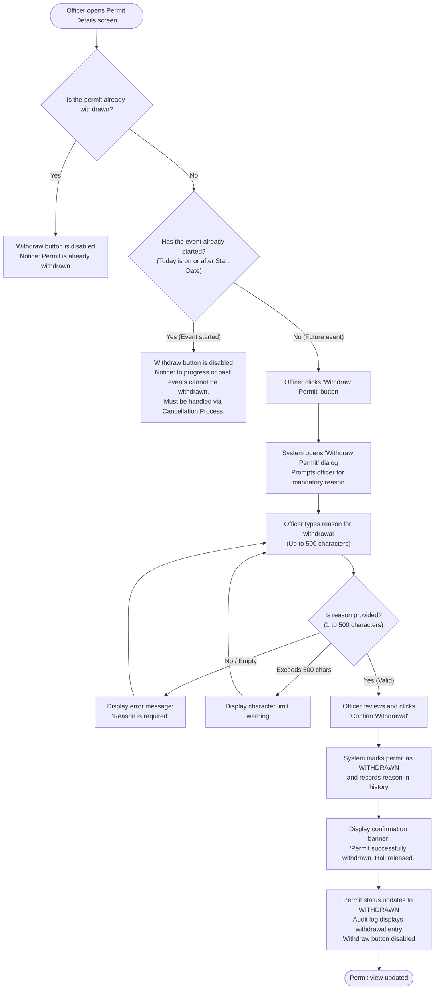

# Artifact 1a — Business Flowchart: RC-4 (Withdraw a Permit)

> **Audience:** Non-technical council officers, Hall Supervisors, and Public-Sector Stakeholders  
> **Rule:** No HTTP verbs, no database tables, no JSON fields, no technical jargon.

### Key Business Decisions Displayed to Officers:
1. **Unstarted Bookings Only:** Only permits whose events have not yet commenced can be withdrawn. If the date has passed or the event is underway, it must follow the Cancellation procedure.
2. **Mandatory Audit Reason:** Council regulations require an official explanation (e.g. holder requested, illness, severe weather) up to 500 characters.
3. **No Financial Refund in this System:** Withdrawal releases the facility reservation. If a refund is due, it is issued by Council Finance through their separate accounting portal.
