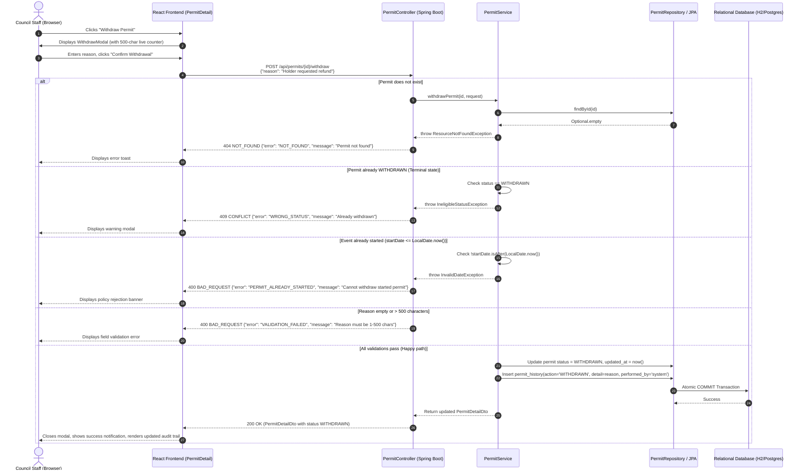

# Artifact 1b — Technical Flowchart: RC-4 (Withdraw a Permit)

> **Audience:** System architects, backend engineers, and AI code generation agents.

```mermaid
sequenceDiagram
    autonumber
    actor Officer as Council Staff (Browser)
    participant UI as React Frontend (PermitDetail)
    participant Controller as PermitController (Spring Boot)
    participant Service as PermitService
    participant Repo as PermitRepository / JPA
    participant DB as Relational Database (H2/Postgres)

    Officer->>UI: Clicks "Withdraw Permit"
    UI->>Officer: Displays WithdrawModal (with 500-char live counter)
    Officer->>UI: Enters reason, clicks "Confirm Withdrawal"
    
    UI->>Controller: POST /api/permits/{id}/withdraw<br/>{"reason": "Holder requested refund"}
    
    alt Permit does not exist
        Controller->>Service: withdrawPermit(id, request)
        Service->>Repo: findById(id)
        Repo-->>Service: Optional.empty
        Service-->>Controller: throw ResourceNotFoundException
        Controller-->>UI: 404 NOT_FOUND {"error": "NOT_FOUND", "message": "Permit not found"}
        UI-->>Officer: Displays error toast
    else Permit already WITHDRAWN (Terminal state)
        Service->>Service: Check status == WITHDRAWN
        Service-->>Controller: throw IneligibleStatusException
        Controller-->>UI: 409 CONFLICT {"error": "WRONG_STATUS", "message": "Already withdrawn"}
        UI-->>Officer: Displays warning modal
    else Event already started (startDate <= LocalDate.now())
        Service->>Service: Check !startDate.isAfter(LocalDate.now())
        Service-->>Controller: throw InvalidDateException
        Controller-->>UI: 400 BAD_REQUEST {"error": "PERMIT_ALREADY_STARTED", "message": "Cannot withdraw started permit"}
        UI-->>Officer: Displays policy rejection banner
    else Reason empty or > 500 characters
        Controller-->>UI: 400 BAD_REQUEST {"error": "VALIDATION_FAILED", "message": "Reason must be 1-500 chars"}
        UI-->>Officer: Displays field validation error
    else All validations pass (Happy path)
        Service->>Repo: Update permit status = WITHDRAWN, updated_at = now()
        Service->>Repo: Insert permit_history(action='WITHDRAWN', detail=reason, performed_by='system')
        Repo->>DB: Atomic COMMIT Transaction
        DB-->>Repo: Success
        Service-->>Controller: Return updated PermitDetailDto
        Controller-->>UI: 200 OK (PermitDetailDto with status WITHDRAWN)
        UI-->>Officer: Closes modal, shows success notification, renders updated audit trail
    end
```
